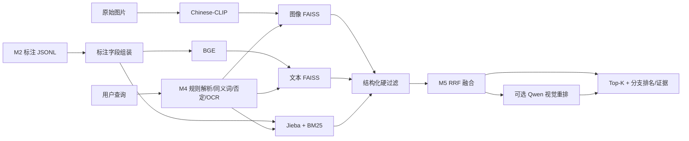

# Anima M3-M5 交付说明与实验执行指南

日期：2026-08-09  
交付范围：M3 三路索引、M4 查询理解、M5 混合检索与可选视觉重排  
运行基线：Windows、Python 3.11、RTX 3070 Ti Laptop 8GB  
上游输入：M2 `caption_verified_v4` 结构化标注  
计划输出：Train/Val 三路索引、检索结果、人工审核后的正式评测指标

## 1. 当前结论

M3-M5 的核心工程代码已经实现，自动化测试和小规模真实模型链路已经通过。当前可用于代码联调和演示，但不能把 smoke 结果当作正式实验结论。

已验证：

- 自动化测试：`39 passed`（交付前最终测试填写，以 ZIP 内 `DELIVERY_MANIFEST.json` 为准）。
- 真实 Train smoke 索引：20 条记录，`image/text/bm25` 三路构建无失败。
- 基础查询：`日落高速公路，没有人物`，`train-0` 为 Top-1，三个分支均排第 1。
- 单候选 Qwen 重排：`train-0` 得分 95，端到端通过。
- 8GB 显存可运行三个检索模型；Qwen 与其他大模型应串行加载。

尚未完成：

- M2 全量标注交付与验收。
- Train 2000 / Val 369 的全量索引。
- 人工审核的 Val 查询及相关性标签。
- Recall@K、MRR、mAP、nDCG 和全量延迟指标。

## 2. 模块边界



### M3：三路索引

| 分支 | 输入 | 编码/算法 | 输出 |
|---|---|---|---|
| `image` | 原始图片 | Chinese-CLIP image encoder | 512 维 FAISS IP |
| `text` | 结构化标注文档 | BGE small zh | 512 维 FAISS IP |
| `bm25` | 结构化标注文档 | Jieba + BM25Okapi | Pickle 稀疏索引 |

### M4：查询理解

- 默认使用规则解析，不依赖 Qwen。
- 支持对象、场景、颜色、OCR 引号查询、数量和否定条件。
- 使用 `configs/retrieval_aliases.yaml` 做同义词归一化。
- Qwen 查询解析为可选扩展，默认 `query_parser_use_llm: false`。

### M5：融合与重排

- 每个分支独立召回候选。
- RRF 前执行必需词、排除词和 OCR 硬过滤。
- 一条分支失败时自动使用剩余分支；全部失败才中止。
- 输出原始分数、分支排名、活跃分支、命中字段和不匹配证据。
- Qwen 视觉重排默认关闭；启用时按 `RRF 0.35 + VLM 0.65` 组合。

## 3. 主要代码

```text
scripts/build_indexes.py                    M3 索引构建入口
scripts/search_cli.py                       命令行检索
scripts/verify_m3_m5.py                     一键真实链路验证
scripts/launch_app.py                       Gradio 交互入口
scripts/run_m3_m5_pipeline.py               全量可恢复流水线

src/anima_search/indexing/                  M3 三路索引与 manifest
src/anima_search/retrieval/query_parser.py  M4 查询解析
src/anima_search/retrieval/terms.py         同义词和否定词
src/anima_search/retrieval/filters.py       结构化硬过滤
src/anima_search/retrieval/search.py        三路召回与降级
src/anima_search/retrieval/fusion.py        RRF 融合
src/anima_search/retrieval/reranker.py      Qwen 视觉重排
src/anima_search/app/factory.py             服务组装与可移植模型路径
src/anima_search/app/service.py             对外服务接口
```

## 4. 数据契约

项目默认目录：

```text
anima/
  artifacts/
    annotations/
      train.caption_verified_v4.jsonl
      val.caption_verified_v4.jsonl
    indexes/
      train/
      val/
  models/
    bge-small-zh-v1.5/
    chinese-clip-vit-base-patch16/
  Qwen--Qwen3-VL-2B-Instruct/snapshots/master/
../Train/*.jpg
../Val/*.jpg
```

每条 M2 标注必须满足 `ImageAnnotation`，核心字段为：

```json
{
  "image_id": "train-0",
  "split": "Train",
  "relative_path": "../Train/0.jpg",
  "sha256": "...",
  "summary": "图片摘要",
  "objects": ["汽车"],
  "actions": [],
  "scene": "高速公路",
  "attributes": [],
  "spatial_relations": [],
  "style": ["摄影"],
  "mood": [],
  "colors": ["橙色"],
  "ocr_text": [],
  "search_queries": ["查询1", "查询2", "查询3"],
  "generation_prompt": "...",
  "uncertainty": [],
  "model_version": "...",
  "prompt_version": "caption_verified_v4"
}
```

全量构建前必须确认：

1. `image_id` 唯一。
2. 标注 ID 与 manifest 完全一致。
3. `sha256`、`relative_path`、`prompt_version` 一致。
4. Train/Val 不混用。
5. 自动标注失败记录已经补齐或明确排除。

## 5. 环境与模型

### 5.1 Pixi

```powershell
pixi install
pixi run python -m pytest -q
```

### 5.2 Python venv 备选

```powershell
py -3.11 -m venv .venv
& '.venv\Scripts\python.exe' -m pip install -U pip
& '.venv\Scripts\python.exe' -m pip install -r requirements-m3-m5.txt
```

模型目录及用途：

| 模型 | 推荐模型 ID | 本地大小 | 是否必需 |
|---|---|---:|---|
| BGE | `BAAI/bge-small-zh-v1.5` | 约 0.18GB | text 分支必需 |
| Chinese-CLIP | `OFA-Sys/chinese-clip-vit-base-patch16` | 约 1.4GB | image 分支必需 |
| Qwen | `Qwen/Qwen3-VL-2B-Instruct` | 约 4GB | 仅视觉重排/问答需要 |

模型权重不应提交到 Git。组员应从官方模型仓库下载到上述目录，并遵守对应许可证。

## 6. 执行顺序

### 6.1 接收 M2 标注

把 Train/Val v4 JSONL 放到 `artifacts/annotations/`，不要覆盖为其他 Prompt 版本。

### 6.2 构建三路索引

先做 smoke：

```powershell
python scripts/build_indexes.py --config configs/default.yaml --split Train --limit 20 --branches image,text,bm25
python scripts/verify_m3_m5.py --config configs/default.yaml --split train --expected-top-id train-0
```

smoke 通过后构建全量：

```powershell
python scripts/build_indexes.py --config configs/default.yaml --split Train --branches image,text,bm25
python scripts/build_indexes.py --config configs/default.yaml --split Val --branches image,text,bm25
```

### 6.3 检索

```powershell
python scripts/search_cli.py "日落高速公路，没有人物" --config configs/default.yaml --split train
```

### 6.4 可选 Qwen 重排

先用一个候选验证显存和输出契约：

```powershell
python scripts/verify_m3_m5.py --config configs/default.yaml --split train `
  --expected-top-id train-0 --rerank --rerank-count 1
```

### 6.5 交互界面

```powershell
python scripts/launch_app.py --config configs/default.yaml --split val --port 7860
```

打开 `http://127.0.0.1:7860`。视觉重排默认关闭，不带 Qwen 也可以使用基础搜索。

## 7. 测试

```powershell
python -m pytest -q
python -m compileall -q src scripts tests
python scripts/verify_m3_m5.py --config configs/default.yaml --split train `
  --query "日落高速公路，没有人物" --expected-top-id train-0 `
  --require-branches image,text,bm25
```

测试覆盖：

- BM25、BGE、Chinese-CLIP 索引保存/加载。
- Transformers Chinese-CLIP 新旧返回值兼容。
- 索引移动后从当前配置重新绑定模型路径。
- 查询解析、否定词、OCR 和同义词。
- 过滤发生在 RRF 之前。
- 三路 RRF 排名与 provenance。
- 单分支失败降级和全部失败报错。
- Qwen 重排对象契约、标量字段归一化和异常降级。
- CLI 索引构建、服务装配和流水线完整性校验。

## 8. 正式实验计划

正式评测将回答：

1. 三路融合是否优于 BM25、BGE、Chinese-CLIP 单路？
2. 结构化过滤是否改善否定、OCR、组合查询？
3. Qwen 重排带来的质量提升是否值得其延迟？

公平比较要求：

| 项目 | 统一设置 |
|---|---|
| 数据 | 相同 Val split 和相同标注版本 |
| 候选数 | 所有分支相同 `candidate_count` |
| Top-K | 相同结果数 |
| Query | 同一批人工审核查询 |
| 随机性 | 当前检索确定性；生成类实验固定 seed |

计划指标：Recall@1/5/10、MRR、mAP、nDCG@10、平均查询延迟。Qwen 重排还应单独报告 P50/P95 延迟和失败率。

评测种子生成后必须人工改写、分类并设置 `reviewed=true`：

```powershell
python scripts/create_eval_set.py --config configs/default.yaml --count 100
python scripts/evaluate_retrieval.py --config configs/default.yaml
```

程序会拒绝使用未审核的 `auto_seed` 直接生成正式指标。

## 9. 预期输出

```text
artifacts/indexes/train/{image,text,bm25.pkl,manifest.json,annotations.json}
artifacts/indexes/val/{image,text,bm25.pkl,manifest.json,annotations.json}
artifacts/evaluation/val_queries.jsonl
artifacts/evaluation/val_relevance.csv
artifacts/evaluation/retrieval_metrics.json
artifacts/evaluation/retrieval_details.csv
```

## 10. 风险与处理

| 风险 | 处理方式 |
|---|---|
| M2 标注缺失或路径不一致 | 全量流水线在建索引前执行 ID/哈希/路径/版本校验 |
| 数据泄漏 | Train/Val manifest 分离；正式查询必须人工审核 |
| 不公平比较 | 固定 split、标注版本、候选数和指标 |
| 模型路径不可移植 | 加载索引后以当前配置重新绑定本地模型目录 |
| 8GB 显存不足 | 模型串行加载；Qwen 重排默认关闭 |
| Qwen 输出格式漂移 | 单对象 Prompt、字段归一化和异常降级 |
| 重排延迟高 | 先测试 1 个候选，正式实验报告延迟并限制 rerank_count |
| Windows 中文路径 | FAISS 使用 Unicode 安全读写适配层 |
| 结果不稳定 | 检索链路保持确定性，生成扩展固定 seed |

## 11. 组员交接清单

- [ ] 解压交付包并安装 Python 3.11 环境。
- [ ] 下载 BGE 和 Chinese-CLIP；需要重排时再下载 Qwen。
- [ ] 修改 `configs/default.yaml` 中数据和模型路径。
- [ ] 接收并验证完整 M2 Train/Val v4 标注。
- [ ] 运行 `python -m pytest -q`。
- [ ] 构建 20 条 smoke 索引并运行 `verify_m3_m5.py`。
- [ ] 构建全量 Train/Val 三路索引。
- [ ] 人工审核 100 条 Val query 和 relevance。
- [ ] 运行基础检索、消融和可选 Qwen 重排评测。
- [ ] 把真实指标写入最终报告，不引用 smoke Top-1 作为正式结论。

## 12. 非交付内容

ZIP 不包含：原始 Train/Val 图片、模型权重、`.pixi` 环境、未完成标注、生成图片和本机缓存。它们体积大或属于上游数据，应通过团队约定的共享位置单独交付。

完成全量实验后，把本文件中的“计划指标”和“待完成”改写为真实结果分析，并附上 `retrieval_metrics.json`、检索明细和失败案例。
