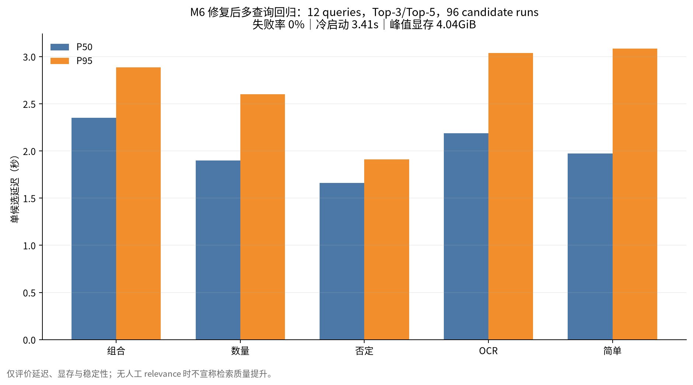
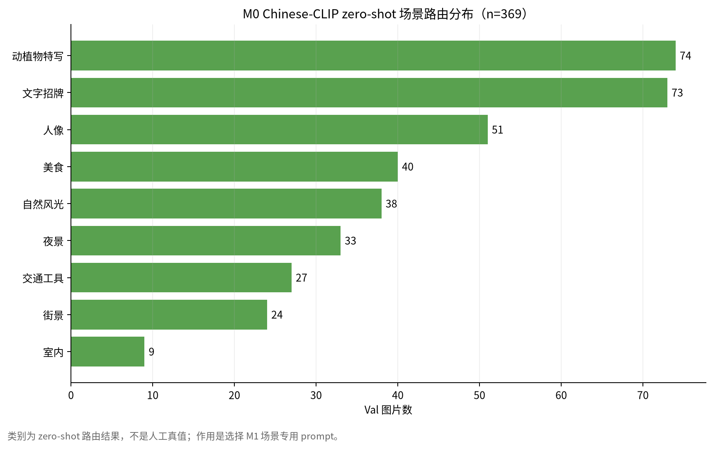

# 四项优先任务实施报告

日期：2026-08-10
基线提交：`4457459`
硬件：RTX 4060 Laptop 8GB
运行环境：Conda `vlm-course`

## 1. 执行结论

| 优先级 | 任务 | 工程状态 | 人工/正式数据状态 |
|---:|---|---|---|
| 1 | M7 真实 UI 联调 | 已完成并真实调用 Qwen-VL | 正式人工质量评测待做 |
| 2 | 100 条人工评测集 | 任务、标注 UI、保存与校验已完成 | 0/100，必须由组员看图填写 |
| 3 | M6 多查询 benchmark | 12 queries、Top-3/5、冷/热统计已完成 | 无 relevance，不评价质量提升 |
| 4 | M0 zero-shot 场景路由 | 369 张 Val 全量完成 | zero-shot 结果不是人工真值 |

## 2. M7 真实 UI 与端到端联调

真实 Gradio 页面新增“M7 证据问答与视觉故事”标签页：

- 搜索后自动把当前图片 ID 写入多选框。
- 问答只允许选择 1–3 张图片。
- 视觉故事要求选择 3–8 张图片。
- 回答引用必须属于当前选择，格式为 `[img_val-xxxx]`。
- 证据不足时返回明确拒答。
- 页面展示回答、引用、置信度和逐图证据 JSON。
- 在加载 Qwen-VL 前主动释放 Chinese-CLIP，避免两者同时常驻 8GB 显存。

HTTP 联调：`http://127.0.0.1:7861/` 返回 200。

真实调用：

- 查询：`雨夜城市街道`
- 候选：`val-2322`
- 问题：`第一张图片中能直接确认什么？`
- 回答成功，引用：`[img_val-2322]`
- 逐图证据包含城市夜景、高楼、灯光和暗色天空。
- 对城市名称和具体地点保留不确定性。

启动：

```bash
env -u ALL_PROXY -u all_proxy \
  conda run -n vlm-course \
  python scripts/launch_app.py \
  --config configs/benchmark_8gb.yaml --split val --port 7861
```

## 3. 100 条人工评测任务

工作区：`evaluation/manual_val/`

- `queries.jsonl`：100 条固定抽样任务。
- `relevance.csv`：人工 relevance 表，目前只有表头。
- `README.md`：团队填写规范。
- `scripts/launch_eval_annotator.py`：Gradio 标注页。
- `scripts/validate_manual_eval_set.py`：正式使用前的强制检查。

标注页已实际启动并返回 HTTP 200。

当前保持所有 query 为空、`reviewed=false`，没有把自动 caption 或模型检索结果冒充人工标注。校验脚本当前应失败，直到每条任务满足：

1. 人工看原图写 query。
2. 标注 query category。
3. 填写真实 annotator。
4. 至少一个 `relevance=2` 图片。
5. 人工确认后设置 `reviewed=true`。

启动：

```bash
env -u ALL_PROXY -u all_proxy \
  conda run -n vlm-course \
  python scripts/launch_eval_annotator.py --port 7862
```

正式评测前还应将 CLIP、text、BM25、RRF 的候选汇集为 pool，再由人工判断除来源图以外的相关图片。

## 4. M6 多查询 8GB benchmark

新增 12 条运行查询，覆盖：

- simple
- compositional
- negative
- count
- OCR

第一次运行使用 `max_new_tokens=128`：

- 12 queries
- Top-3 和 Top-5
- 每种重复 3 次
- 288 candidate runs
- 峰值显存约 4.04 GiB
- 失败 42 次，失败率 14.6%

失败样本的原始响应证明：长 `evidence/mismatch` 使 JSON 在 `confidence` 字段前被 128 tokens 截断。该问题与显存无关。

将 `configs/benchmark_8gb.yaml` 调整为 `rerank_max_new_tokens: 256` 后，运行完整查询覆盖回归：

- 12 queries
- Top-3 和 Top-5
- 96 candidate runs
- 失败率 0%
- 冷启动 3.406 s
- 热启动平均 2.086 s
- 热启动 P50 1.974 s
- 热启动 P95 2.834 s
- 峰值显存 4,337,878,528 bytes，约 4.04 GiB



运行：

```bash
conda run -n vlm-course \
  python scripts/benchmark_reranker_suite.py \
  --top-k 3 5 --repeats 3 \
  --output artifacts/evaluation/m6_multiquery_8gb.jsonl
```

这些数据只能证明延迟、显存和稳定性；没有人工 relevance 时不能证明 reranker 提升 Recall、MRR 或 nDCG。

## 5. M0 Chinese-CLIP 场景路由

新增九类 zero-shot 路由：

- 室内
- 街景
- 自然风光
- 人像
- 美食
- 夜景
- 文字招牌
- 交通工具
- 动植物特写

路由直接复用现有 FAISS 图像向量，只额外编码类别文本 prompt。每张图输出：

- 最优场景类别与分数。
- Top-3 类别分数。
- 对应 M1 的场景专用 `prompt_suffix`。

369 张 Val 实跑分布：

| 类别 | 图片数 |
|---|---:|
| 动植物特写 | 74 |
| 文字招牌 | 73 |
| 人像 | 51 |
| 美食 | 40 |
| 自然风光 | 38 |
| 夜景 | 33 |
| 交通工具 | 27 |
| 街景 | 24 |
| 室内 | 9 |



运行：

```bash
env -u ALL_PROXY -u all_proxy \
  conda run -n vlm-course \
  python scripts/route_scenes.py --split val --top-n 3
```

这些类别是用于 prompt 分发的 zero-shot 工程路由，不是人工场景真值。后续可抽样 50 张人工检查混淆情况，再决定是否修改类别 prompt。

## 6. 下一步

自动标注到达前仍可以继续：

1. 实现隐藏测试集的一键目录流水线。
2. 分工填写 100 条人工 query/relevance。
3. 将 M7 页面录制成 3 分钟演示。
4. 实现 M2 CHAIR/GroundingDINO 和 EchoBack 的接口、缓存及测试。
5. 补充 Docker、`DEPLOY.md` 和最终 LaTeX 图表模板。

标注到达后再执行三路索引、A5 正式消融和 A6 重排质量对照。
