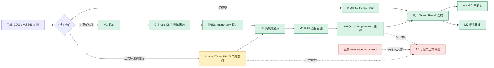
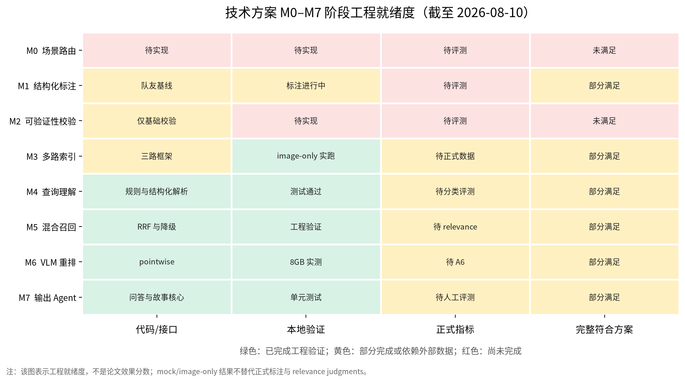
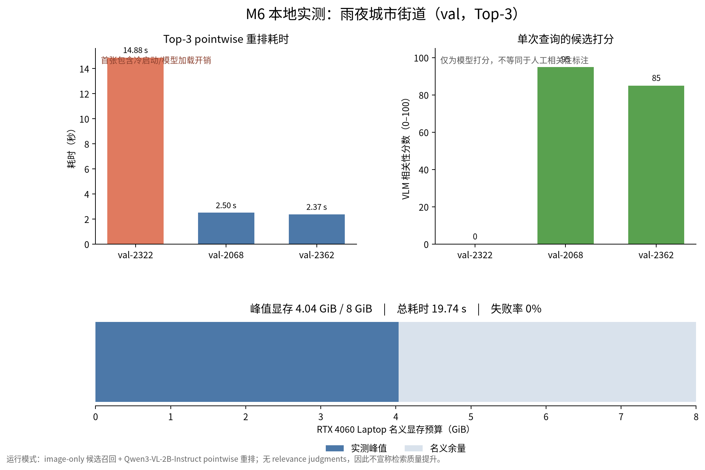

# AskAlbum 阶段性技术报告

日期：2026-08-10
环境：Linux、RTX 4060 Laptop 8GB、Conda 环境 `vlm-course`
对照方案：`VLM_Final_Project_Technical_Proposal.md`
接手基线：Git 提交 `222f232 Add M3-M5 multimodal retrieval pipeline`

## 1. 阶段结论

本阶段在队友提交的 M3–M5 检索框架上，重点完成了“正式标注尚未冻结时仍可并行开发”的工程路径：

1. 增加 Conda/Linux 可复现环境，并在本机完成 CUDA、依赖、测试与编译验证。
2. 增加 mock 模式，使原图存在但标注和索引缺失时仍可启动 Gradio 界面。
3. 增加 annotation schema 适配器和 image-only 索引路径，使用 Chinese-CLIP 对 369 张 Val 原图完成真实建索引与中文查询。
4. 补强 M4 对数量、时间、天气和正向过滤模式的结构化处理。
5. 将 M6 pointwise reranker 改造成可独立测量的 8GB 显存 benchmark，并实际完成 Top-3 测试。
6. 新增 M7 带图片引用的问答、证据不足拒答和 3–8 张图片的视觉故事核心逻辑。
7. 完善正式评测与 A5 消融执行框架，并明确阻止未审核 query 或缺少 relevance 的结果被误当作正式指标。

当前代码已经形成 M3–M7 的可测试工程骨架，其中 M3 image-only 和 M6 pointwise 已有真实模型实测；但整个技术方案尚未完成。M0、M2 的核心算法、最终标注驱动的三路检索、正式 relevance 评测、M6 listwise 对照和完整 M7 Demo 仍需后续工作。

## 2. 工作归属与基线

### 2.1 队友基线 `222f232`

队友提交已经提供：

- M1 风格的标注 schema、Qwen-VL 客户端和标注流水线基础。
- M3 的 image/text/BM25 三路索引类与索引清单。
- M4 查询解析基础、否定规则和别名表。
- M5 RRF 混合召回、分支降级和检索结果契约。
- M6 pointwise reranker 基础接口。
- Stable Diffusion 生成接口、Gradio 页面和基础测试。
- Pixi Windows 环境与 M3–M5 交付说明。

### 2.2 本阶段在基线上的新增与补强

| 工作 | 主要文件 | 可验证产物 |
|---|---|---|
| Conda/Linux 环境 | `environment.yml` | `pip check` 通过，71 项测试通过 |
| 无标注开发计划与文档 | `LOCAL_NO_ANNOTATION_PLAN.md`、`README.md` | mock/image-only/full 三种模式说明 |
| 标注兼容层 | `src/anima_search/adapters/annotation.py` | 嵌套方案 schema 与扁平 schema 统一转换 |
| Mock UI | `src/anima_search/app/mock_service.py`、`mock_ui.py`、`scripts/launch_mock_app.py` | 本地 HTTP 200 |
| Image-only M3 | `src/anima_search/indexing/image_only.py`、`scripts/build_image_only_index.py` | Val 369 张 Chinese-CLIP/FAISS 索引 |
| M4 补强 | `query_parser.py`、`filters.py`、`schemas.py` | 数量 `eq/gte/lte`、时间、天气和过滤测试 |
| M5/A5 评测框架 | `evaluation/runner.py`、`ablation.py`、相关 CLI | JSON/CSV/LaTeX 输出与人工审核防护 |
| M6 实测 | `rerank_benchmark.py`、`benchmark_reranker.py`、`benchmark_8gb.yaml` | Top-3、0% 失败、峰值 4.04 GiB |
| M7 核心 | `src/anima_search/m7/` | 带引用回答、拒答、视觉故事及单元测试 |
| 可视化 | `scripts/generate_stage_report_figures.py` | 本报告的就绪度图与 benchmark 图 |

以上归属是以 Git 基线提交与当前工作区差异为依据，而不是仅按文件作者或口头描述推断。

## 3. 当前系统流程



绿色节点表示本阶段已有代码或本地验证；黄色表示框架存在但依赖正式数据；红色表示当前外部数据或实验尚未完成。

## 4. 可视化结果

### 4.1 M0–M7 阶段工程就绪度



该图刻意分开“代码存在”“本地验证”“正式指标”和“完整符合方案”。因此 M3–M7 即使已有较多绿色工程项，也不会被错误表述为整个课程方案已完成。

### 4.2 M6 的 8GB 显存实测



图中首张候选的耗时包含 Qwen3-VL 冷启动和模型加载，因此不能把三张图片的简单均值当作稳定吞吐。后两张更接近模型已经加载后的单图耗时。

重新生成图表：

```bash
conda activate vlm-course
python scripts/generate_stage_report_figures.py
```

## 5. 本地实测证据

### 5.1 数据与索引

| 项目 | 结果 |
|---|---:|
| Train 原图 | 2000 |
| Val 原图 | 369 |
| 无效图片 | 0 |
| Train 重复图组 | 10 |
| Val image-only 索引记录 | 369 |
| 索引分支 | image |
| 标注版本标记 | `image-only-manifest-v1` |

image-only 模式中的最小 annotation 只用于保持 `SearchResult` 和应用接口一致，不是 M1/M2 的正式标注，也不能用于 text/BM25 或课程报告的正式指标。

查询“雨夜城市街道”的 Chinese-CLIP Top-3 为：

1. `val-2322`
2. `val-2068`
3. `val-2362`

### 5.2 M6 pointwise benchmark

模型：`Qwen/Qwen3-VL-2B-Instruct`
运行方式：先释放 Chinese-CLIP 编码器，再加载 Qwen-VL，避免两个模型同时占用显存。

| 指标 | 结果 |
|---|---:|
| 候选数 | 3 |
| 重复次数 | 1 |
| 成功/失败 | 3 / 0 |
| 失败率 | 0% |
| 总候选耗时 | 19.738 s |
| 平均每候选 | 6.579 s |
| CUDA 峰值显存 | 4,335,153,664 bytes（约 4.04 GiB） |
| `val-2322` | 14.876 s，score 0 |
| `val-2068` | 2.496 s，score 95 |
| `val-2362` | 2.366 s，score 85 |

这是可行性和资源占用实测，不是检索质量实验。单查询、单次重复和 VLM 自身分数不足以证明 reranker 提升了 Recall、MRR 或 nDCG。

### 5.3 工程质量

| 检查 | 结果 |
|---|---|
| `python -m pip check` | No broken requirements found |
| `python -m pytest -q` | 71 passed |
| `python -m compileall -q src scripts tests` | 通过 |
| Mock Gradio HTTP | 200 |
| `git diff --check` | 通过 |

## 6. 对技术方案 M0–M7 的符合度

| 模块 | 方案要求 | 当前状态与证据 | 判断 | 尚缺内容 |
|---|---|---|---|---|
| M0 | CLIP zero-shot 场景路由和专用 prompt | 当前没有完整场景路由实现 | 未满足 | 路由类别、prompt 分发和 A2 对照 |
| M1 | 多维结构化标注、自洽采样、跨模型验证 | 队友已有 schema、prompt 和标注流水线；正式标注仍在进行 | 部分满足 | 全量标注、3 次采样、字段投票和跨模型结果 |
| M2 | CHAIR、覆盖率、EchoBack、DINOv2 | 当前只有 JSON/schema 基础校验，不等于 M2 | 未满足 | 检测器 grounding、T2I 回译、DINOv2 和相关性分析 |
| M3 | Chinese-CLIP、文本塔和 BM25 三路索引 | 三路代码框架存在；本阶段实跑 369 张 Val image-only | 部分满足 | 用冻结标注实跑 text/BM25 并验证三路索引一致性 |
| M4 | 查询槽位抽取、改写与路由 | 已支持否定、OCR、数量、时间、天气和规则降级 | 部分满足，核心可运行 | 真正接入可选 LLM/API，并做 query category 分层评测 |
| M5 | 三路召回、RRF 和结构化过滤 | RRF、分支解释、过滤和降级已有测试 | 部分满足，框架完成 | 正式标注上的三路实跑与 A5 结果 |
| M6 | pointwise/listwise 重排和 A6 | pointwise 已实现并完成 8GB Top-3 实测 | 部分满足 | listwise、Top-5/多查询重复和有 relevance 的 A6 |
| M7 | 检索页、带引用问答、故事和缺图补全 | 新增问答引用/拒答和视觉故事核心；原服务已有生成接口 | 部分满足 | 真实模型端到端 UI 联调、缺图补全标识与人工质量评测 |

### 总体判断

当前实现符合技术方案的主架构方向，特别是：

- M3 的 Chinese-CLIP 图像检索路径；
- M4 的结构化查询；
- M5 的多路 RRF 框架；
- M6 的 VLM pointwise reranker；
- M7 的证据约束与引用设计；
- 8GB 显存下模型串行加载的资源策略。

但不能写“技术方案已经全部完成”。更准确的阶段表述是：

> 在队友 M3–M5 框架基础上，完成了无正式标注条件下的 image-only 检索、Mock Demo、M4 补强、M6 低显存实测、M7 证据约束核心和正式评测工具链，为标注冻结后的三路检索与 A5/A6 实验扫清了工程阻塞。

## 7. 与课程硬性要求的差距

除 M0–M7 外，技术方案和课程还要求以下最终交付；当前仍不能视为完成：

- 面向任意新目录的一键“标注 → 建索引 → 检索/问答”流水线。
- M1 的全量多维标注与可复跑 prompt engineering 实验。
- M2 的幻觉量化和 EchoBack 创新实验。
- 人工 query、relevance、参考描述、VQA 与 Arena 数据。
- A1–A9 中至少核心 A1、A5、A6 的正式结果。
- Docker/部署文档、最终 LaTeX 论文和演示视频。
- 隐藏测试集到达后的无人工改代码复跑验证。

## 8. 下一阶段建议

按依赖关系排序：

1. 接收并校验队友冻结的 annotation schema 与 Train/Val 标注。
2. 用正式标注重建 Val 的 image/text/BM25 三路索引。
3. 由未参与标注模块的成员完成至少 100 条人工 query 和 relevance judgments。
4. 运行 A5：CLIP-only、text-only、BM25-only、三路 RRF。
5. 扩展 M6 到多查询、Top-3/Top-5、多次重复，并加入“无重排 vs pointwise”；资源允许时再做 listwise。
6. 将 M7 的问答与故事接入真实 Gradio 页面，录制可复现的端到端演示。
7. 并行推进 M0/M2；M2 是当前与技术方案学术创新点之间最大的缺口。

## 9. 复现命令

```bash
conda activate vlm-course

# 质量检查
python -m pip check
PYTEST_DISABLE_PLUGIN_AUTOLOAD=1 python -m pytest -q
python -m compileall -q src scripts tests

# Mock UI
env -u ALL_PROXY -u all_proxy \
  python scripts/launch_mock_app.py --split val --port 7860

# 无标注 image-only 索引
python scripts/build_manifest.py --config configs/default.yaml
python scripts/build_image_only_index.py --config configs/default.yaml --split Val
python scripts/search_cli.py "雨夜城市街道" --split val --branches image

# 8GB M6 benchmark
python scripts/benchmark_reranker.py "雨夜城市街道" \
  --config configs/benchmark_8gb.yaml \
  --split val --branches image --top-k 3 --repeats 1 \
  --output artifacts/evaluation/reranker_top3_8gb.jsonl

# 报告图表
python scripts/generate_stage_report_figures.py
```

本地模型权重、原图、索引和 benchmark 原始产物由 `.gitignore` 排除；仓库只提交代码、配置、报告和可公开的汇总图表。
